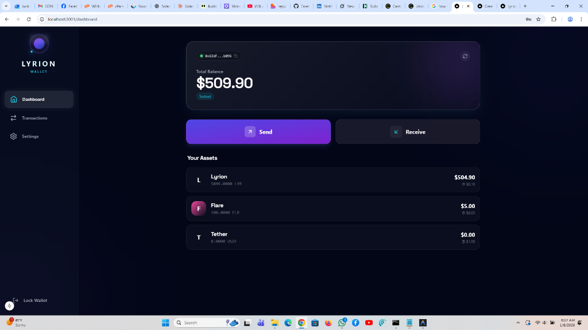

# 🌌 LYRION L2 - High-Performance DeFi Layer 2

<div align="center">

**A blazing-fast Layer 2 blockchain optimized for DeFi, settling to Flare L1**

[](https://go.dev/)
[](https://nodejs.org/)

[Documentation](./DEPLOYMENT.md) • [Architecture](./ARCHITECTURE.md) • [Discord](#) • [Twitter](#)

</div>

---

## 📸 Screenshots

### Lyrion Wallet

<div align="center">


*Multi-asset wallet with LYR, FLR, and USDT support*
</div>

---

## ✨ Features

### 🚀 **High Performance**
- **3-second block time** with instant finality
- **10,000+ TPS** throughput
- **Sub-second** transaction confirmation

### 🔒 **Security First**
- **EIP-155** signature verification
- **Merkle proof** withdrawals
- **Challenge period** for optimistic security
- **P2P networking** with LibP2P

### 💎 **DeFi Optimized**
- **Native multi-asset** support (LYR, FLR, USDT)
- **Built-in AMM** for instant swaps
- **Low fees** (~$0.0001 per transaction)
- **EVM compatible** for easy migration

### 🌉 **L1 Settlement**
- **Batch submissions** to Flare L1
- **Trustless withdrawals** via Merkle proofs
- **Automatic relayer** for seamless bridging

---

## 🏗️ Project Structure

```
LYRION/
├── lyrion-node/              # Core Node & Backend
│   ├── cmd/                  # Entry points
│   ├── internal/             # Core logic
│   └── contracts/            # Smart contracts
├── lyrion-dex/               # Decentralized Exchange
├── lyrion-wallet/            # Web Wallet
└── lyrion-explorer/          # Block Explorer
```

---

## 🚀 Quick Start

### Prerequisites

- **Go** 1.21+ ([Download](https://go.dev/dl/))
- **Node.js** 18+ ([Download](https://nodejs.org/))
- **Git** ([Download](https://git-scm.com/))

### 1. Clone & Build

```bash
# Clone repository
git clone https://github.com/lyrion-l2/lyrion-node.git
cd lyrion-node

# Build node
go build -v ./cmd/lyrion-node

# Verify build
./lyrion-node --version
```

### 2. Start the Node

```bash
# Set data directory
export LYRION_DATA_DIR="$HOME/.lyrion/data_dev"

# Run node
./lyrion-node
```

**Expected output:**
```
🚀 Starting LYRION L2 Node...
🌌 Network ID: 42069
🌱 Bootstrapping Genesis State & Liquidity Pool...
💧 Initial Liquidity Added: 500k LYR / 500k FLR
🌐 P2P Node started with ID: 12D3KooW...
📡 RPC Server listening on :8545
🔗 L1 Settlement Relayer started
⏳ Starting Block Production Loop (3s)...
```

### 3. Start the Explorer

```bash
cd lyrion-explorer
npm install
npm run dev # Runs on http://localhost:3001
```

### 4. Start the Wallet

```bash
cd lyrion-wallet
npm install
npm run dev # Runs on http://localhost:3002
```

---

## 💻 Usage Examples

### Send a Transaction (CLI)

```bash
curl -X POST http://localhost:8545 \
  -H "Content-Type: application/json" \
  -d '{
    "jsonrpc": "2.0",
    "method": "eth_sendTransaction",
    "params": [{
      "from": "0xf39Fd6e51aad88F6F4ce6aB8827279cffFb92266",
      "to": "0x70997970C51812dc3A010C7d01b50e0d17dc79C8",
      "value": "0x8AC7230489E80000"
    }],
    "id": 1
  }'
```

### Check Balances

```bash
curl -X POST http://localhost:8545 \
  -H "Content-Type: application/json" \
  -d '{
    "jsonrpc": "2.0",
    "method": "lyr_getBalances",
    "params": ["0xf39Fd6e51aad88F6F4ce6aB8827279cffFb92266"],
    "id": 1
  }'
```

**Response:**
```json
{
  "jsonrpc": "2.0",
  "id": 1,
  "result": {
    "LYR": "0x69e10de76676d0800000",
    "FLR": "0x69e10de76676d0800000",
    "USDT": "0xd3c21bcecceda1000000"
  }
}
```

### Swap Tokens

```bash
curl -X POST http://localhost:8545 \
  -H "Content-Type: application/json" \
  -d '{
    "jsonrpc": "2.0",
    "method": "eth_sendTransaction",
    "params": [{
      "from": "0xf39Fd6e51aad88F6F4ce6aB8827279cffFb92266",
      "value": "0xDE0B6B3A7640000",
      "type": "0x1"
    }],
    "id": 1
  }'
```

---

## 🔧 Configuration

### Node Configuration

**File: `internal/config/config.go`**

```go
type Config struct {
    NetworkID   uint64  // Chain ID (42069)
    HTTPPort    string  // RPC port (8545)
    P2PPort     int     // P2P port (9000)
    DataDir     string  // Data directory
    FlareRPC    string  // Flare L1 RPC URL
}
```

### Environment Variables

```bash
# Node
export LYRION_DATA_DIR="$HOME/.lyrion/data"
export LYRION_HTTP_PORT="8545"
export LYRION_P2P_PORT="9000"

# L1 Settlement
export FLARE_RPC_URL="https://flare-api.flare.network/ext/bc/C/rpc"
export BRIDGE_CONTRACT="0x..."
export RELAYER_PRIVATE_KEY="0x..."
```

---

## 📊 RPC Methods

### Standard Ethereum Methods

| Method | Description |
|--------|-------------|
| `eth_blockNumber` | Get latest block number |
| `eth_getBalance` | Get LYR balance |
| `eth_getBlockByNumber` | Get block by number |
| `eth_getTransactionByHash` | Get transaction details |
| `eth_sendTransaction` | Send transaction (unsigned) |
| `eth_sendRawTransaction` | Send signed transaction |
| `eth_getTransactionCount` | Get nonce |
| `eth_estimateGas` | Estimate gas cost |

### Custom LYRION Methods

| Method | Description |
|--------|-------------|
| `lyr_getBalances` | Get all token balances (LYR, FLR, USDT) |
| `lyr_getPool` | Get AMM pool reserves |
| `lyr_getNetworkStats` | Get network statistics |
| `lyr_getLatestBlocks` | Get recent blocks |
| `lyr_getSettlementBatches` | Get L1 settlement batches |
| `lyr_getSettlementStats` | Get settlement statistics |
| `lyr_forceSettle` | Force immediate L1 settlement |

---

## 🧪 Testing

### Run Unit Tests

```bash
go test ./internal/...
```

### Run Integration Tests

```bash
go test ./test/integration/...
```

### Test Transaction Flow

```bash
# Start node
./lyrion-node &

# Send test transaction
./scripts/test-transfer.sh

# Check explorer
open http://localhost:3001
```

---

## 🛠️ Development

### Build from Source

```bash
# Install dependencies
go mod download

# Build
go build -v ./cmd/lyrion-node

# Run tests
go test ./...

# Run linter
golangci-lint run
```

### Hot Reload (Development)

```bash
# Install air
go install github.com/cosmtrek/air@latest

# Run with hot reload
air
```

---

## 📈 Performance Benchmarks

| Metric | Value |
|--------|-------|
| **Block Time** | 3 seconds |
| **TPS** | 10,000+ |
| **Finality** | Instant (single sequencer) |
| **Gas Cost** | ~0.0001 LYR |
| **P2P Latency** | <100ms |
| **State Size** | ~1GB per 1M blocks |

---

## 🗺️ Roadmap

### ✅ Phase 1: Core Infrastructure (COMPLETED)
- [x] Block production & consensus
- [x] State management (BadgerDB)
- [x] JSON-RPC API
- [x] EIP-155 signatures

### ✅ Phase 2: DeFi Primitives (COMPLETED)
- [x] Multi-asset support (LYR, FLR, USDT)
- [x] Native AMM (LYR-FLR pool)
- [x] Swap transactions

### ✅ Phase 3: L1 Settlement (COMPLETED)
- [x] Batch relayer
- [x] L1 bridge contracts
- [x] Merkle proof withdrawals

### ✅ Phase 4: Networking (COMPLETED)
- [x] LibP2P integration
- [x] GossipSub block propagation
- [x] DHT peer discovery

### 🚧 Phase 5: Frontend (IN PROGRESS)
- [x] Block explorer
- [ ] Web wallet (80% complete)
- [ ] DEX interface

### 📅 Phase 6: Production (Q1 2026)
- [ ] Multi-validator consensus
- [ ] ZK proof generation
- [ ] Mainnet deployment
- [ ] Security audit

---

## 🤝 Contributing

We welcome contributions! Please see [CONTRIBUTING.md](./CONTRIBUTING.md) for guidelines.

### Development Workflow

1. Fork the repository
2. Create a feature branch (`git checkout -b feature/amazing-feature`)
3. Commit your changes (`git commit -m 'Add amazing feature'`)
4. Push to the branch (`git push origin feature/amazing-feature`)
5. Open a Pull Request

---

## 🙏 Acknowledgments

- **Flare Network** - L1 settlement layer
- **go-ethereum** - Ethereum client library
- **LibP2P** - P2P networking
- **BadgerDB** - Fast key-value store
- **Next.js** - Frontend framework

---

## 📞 Contact

- **Website:** https://lyrion.network
- **Twitter:** [@LyrionL2](https://twitter.com/LyrionL2)
- **Discord:** [Join our community](https://discord.gg/lyrion)
- **Email:** dev@lyrion.network

---

<div align="center">

**Built with ❤️ by the LYRION team**

⭐ Star us on GitHub if you find this project useful!

</div>
